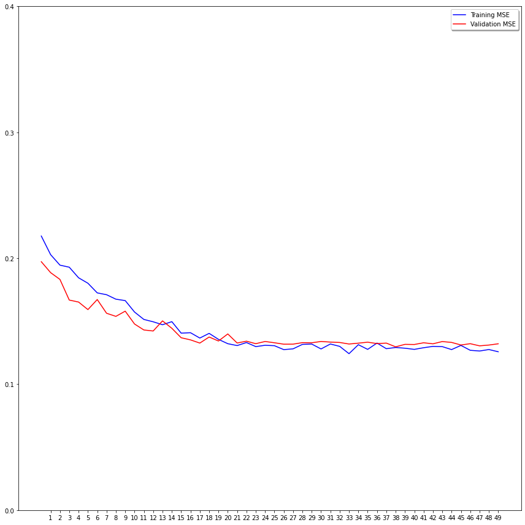
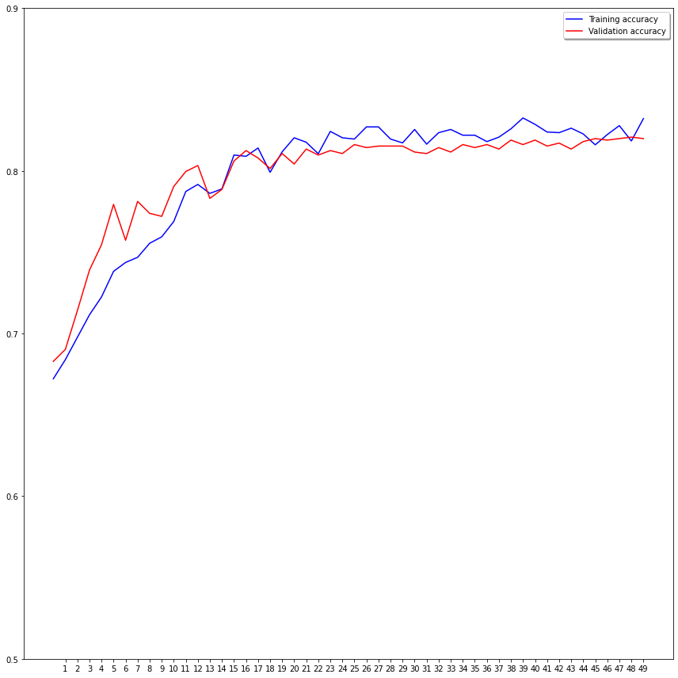

  

# 🐶🐱 Dog and Cat Classification 🐶🐱

## 💻 Código completo no Colab

[Abrir no Colab](https://colab.research.google.com/drive/1H5VC3OMgPVSrZcWJ1ZHbrrNjtDCjuN6P?usp=sharing)

## 📝 Descrição

Algoritmo qeu treina um modelo capaz de classificar imagens de cães e gatos usndo o **Oxford-IIIT Pet Dataset**

## 📈 Gráficos de Treinamento e Validação do modelo

#### Figura 1 - MSE Treinamento x MSE Validação

#### Figura 2 - Acurácia Treinamento x Acurácia Validação

